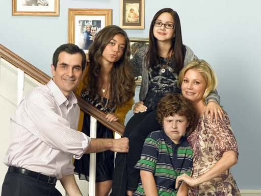

+++
title = "摩登家庭 观影日记"
date = 2026-06-18T21:00:00+08:00
draft = false
tags = ["摩登家庭", "美剧", "治愈系"]
categories = ["美剧观影"]
description = "重温《摩登家庭》，被琐碎温暖的家庭日常治愈"
+++

# 摩登家庭观影日记｜分级标题 + Emoji 排版

## 📝 前言：被代码部署困住的傍晚

忙活一下午折腾 GitHub Pages 部署，满脑子命令行、404 报错、yml 配置，整个人紧绷得慌，索性关掉所有代码窗口，点开《摩登家庭》放空自己。

## 🏠 为什么《摩登家庭》是专属情绪解药

这部剧永远是我的情绪解药。伪纪录片的镜头温柔又松弛，三个截然不同的家庭交织在一起，没有狗血冲突，全是生活里细碎又鲜活的烟火气。

### 🎬 剧中高光片段剪辑

<iframe width="100%" height="450" src="https://player.bilibili.com/player.html?bvid=BV18M4y1U7t2" scrolling="no" frameborder="0" allowfullscreen></iframe>

### 💍 最戳心一幕：米奇与小卡的婚礼

今天重看米奇和小卡婚礼那一集，依旧看一次鼻酸一次。从前刻板、嘴硬的 Jay，嘴上从不擅长表达温柔，却在婚礼结尾郑重走到儿子身边，挽着他走向小卡，坦然向所有人宣告这是他的儿子。从前总觉得 Jay 固执古板，可慢慢看完整部剧才懂，他一直在为家人慢慢柔软，学会接纳不一样的爱与生活方式。

### 👨‍👩‍👧‍👦 三组家庭，三种截然不同的温柔

1. **Phil & Claire 吵闹又暖心的中产小家**

   Phil 永远乐观跳脱，爱耍笨拙的小把戏，常常让 Claire 哭笑不得；三个孩子性格完全迥异，叛逆的 Haley、学霸 Alex、天马行空的 Luke，一家人吵吵闹闹，却永远彼此撑腰。

2. **Jay & Gloria 跨越文化的治愈组合**

   还有歌洛莉亚和曼尼，来自哥伦比亚的热烈与细腻，Jay 被母子俩一点点融化，冰冷的大房子慢慢装满烟火暖意。

## 😂 欢笑与治愈并存，藏在每集结尾的温柔

笑点来得轻松自然，Cam 夸张滑稽的举动、Phil 尴尬又可爱的魔术、孩子们无厘头的打闹，常常看得我抱着抱枕笑出声；可每集结尾短短几句独白，又总能轻轻戳中心底柔软。它告诉我们，家庭从不是完美无缺的乌托邦，会有争吵、误解、代沟，可包容与偏爱永远是底色。

## 🧘 看完剧的感悟：琐事之外，生活本是温情

没有复杂的剧情反转，只是三餐、聚会、旅行、大大小小的琐事，却治愈所有焦虑。刚刚还在为网站部署失败烦躁，看完两集忽然觉得，那些代码、报错、配置难题不过是小事。人最珍贵的还是这种温暖纯粹的联结，接纳彼此的不完美，认真享受身边人的陪伴。

## 🎬 后续计划：慢慢重温完整 11 季

打算接下来每天睡前看一两集，慢慢重温完整 11 季。不管生活多繁杂，总有这一大家子，用平凡的温暖，抚平所有浮躁。
